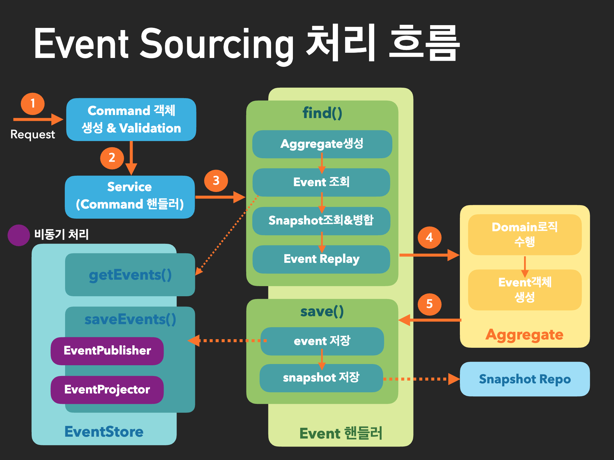

# Event Sourcing

Event Sourcing은 소프트웨어 시스템의 상태를 변경하는 모든 사건(Event)을 영속적인 로그로 저장하고, 현재 상태를 복원할 때 이 로그를 재생(replay)하여 현재 상태를 얻는 디자인 패턴입니다.
이러한 패턴은 전통적인 데이터베이스의 상태 저장 및 갱신 방식 대신에 변경 이벤트를 로그로 저장함으로써 데이터의 변화를 추적하고, 각 이벤트를 통해 시스템의 상태를 복원하는 방식으로 동작합니다.

> UPDATE 혹은 DELETE의 개념이 없다. 상태의 기록(APPEND)만 있을 뿐.
>

> 이벤트 소싱에서는 CQRS가 사실상 필수
>

https://github.com/jaceshim/springcamp2017/blob/master/springcamp2017_implementing_es_cqrs.pdf
> 이렇게 하면 데이터 모델과 비즈니스 도메인을 동기화할 필요가 없고 성능, 확장성 및 응답성이 향상되므로 복잡한 도메인의 태스크를 간소화할 수 있습니다.
>

### 주요 개념:

1. **Event (이벤트):**
    - Event Sourcing에서는 시스템의 상태를 변경하는 모든 사건을 이벤트로 정의합니다. 예를 들어, 주문이 생성되었을 때, 주문 취소가 되었을 때와 같은 모든 중요한 사건은 이벤트로 기록됩니다.

2. **Event Store (이벤트 스토어):**
    - Event Store는 발생한 이벤트를 영속적으로 저장하는 저장소입니다. 각 이벤트는 시간 순서대로 기록되어 시스템의 상태를 이벤트 기록으로 역으로 추적할 수 있게 합니다.

3. **Aggregate (집합체):**
    - Aggregate는 도메인 모델에서 중요한 일관성 경계를 나타내는 개념입니다. Aggregate 내부에서는 변경 가능한 상태를 가지고 있지만, 외부에서는 Aggregate에 접근할 때마다 발생한 이벤트를
      통해 현재 상태를 재구성(reconstruct)합니다.

4. **Projection (프로젝션):**
    - Projection은 시스템의 현재 상태를 나타내기 위해 이벤트 스토어의 이벤트를 읽어와서 적절한 형식으로 **변환(CQRS)** 하는 프로세스를 말합니다. 이를 통해 시스템은 이벤트 로그를 사용하여 현재
      상태를
      복원할 수
      있습니다.
      

### 장점:

1. **이력 추적 및 디버깅:**
    - Event Sourcing은 시스템의 모든 변경 이벤트를 저장하므로, 특정 상태로 돌아가거나 특정 시점의 상태를 살펴보는 등의 이력 추적이 용이합니다.

2. **읽기 최적화:**
    - 읽기 측면에서는 CQRS(Command Query Responsibility Segregation) 패턴과 결합하여 특정 조회 목적에 최적화된 프로젝션을 생성할 수 있습니다.

3. **시스템 간의 통합:**
    - Event Sourcing을 사용하면 시스템 간의 데이터 동기화를 쉽게 구현할 수 있습니다. 각 시스템은 이벤트를 교환함으로써 데이터를 동기화할 수 있습니다.

4. **분산 시스템에 용이:**
    - Event Sourcing은 각 서비스가 독립적으로 변경 가능하고, 각 이벤트를 통해 상태를 동기화할 수 있기 때문에 분산 시스템에서 유용하게 사용될 수 있습니다.

### 단점:

1. **복잡성:**
    - Event Sourcing은 기존의 상태 저장 및 갱신 방식보다 구현이 복잡하며, 특히 도입하기 위해서는 좋은 설계와 구현 경험이 필요합니다.

2. **성능 이슈:**
    - 이벤트가 많아질수록 이벤트 스토어의 크기가 커지고, 이를 처리하기 위한 프로젝션의 복잡성이 증가할 수 있습니다.

Event Sourcing은 특히 [도메인 주도 설계](./domainModelPattern.md)와 함께 사용될 때 매우 강력한 패턴이지만, 단점과 복잡성을 고려하여 프로젝트의 특성에 맞게 선택해야 합니다.

---

- https://learn.microsoft.com/ko-kr/azure/architecture/patterns/event-sourcing
- https://mjspring.medium.com/%EC%9D%B4%EB%B2%A4%ED%8A%B8-%EC%86%8C%EC%8B%B1-event-sourcing-%EA%B0%9C%EB%85%90-50029f50f78c
- [스프링캠프 2017 [Day2 A2] : 이벤트 소싱 소개 (이론부)](https://www.youtube.com/watch?v=TDhknOIYvw4)
- [SPRING CAMP 2017 천보님 발표자료](https://github.com/jaceshim/springcamp2017/blob/master/springcamp2017_implementing_es_cqrs.pdf)
- https://event-driven.io/en/projections_and_read_models_in_event_driven_architecture/