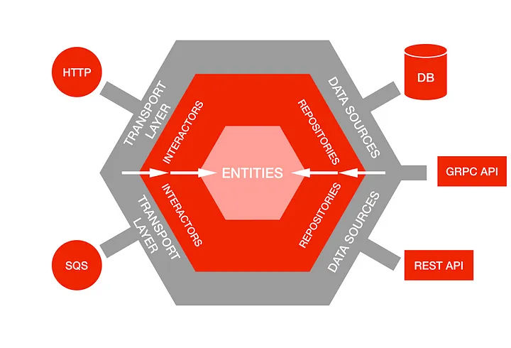

# Hexagonal Architecture

> Port and Adaptor Architecture
>

> [Hexagonal Architecture](https://alistair.cockburn.us/hexagonal-architecture/)
>

> [Layered Architecture](https://github.com/ahastudio/til/blob/main/architecture/layered-architecture.md)
>

[DDD](./layeredArchitecture.md)에서 구분한 [Layered Architecture](./layeredArchitecture.md)가 아닌 전통적인 3계층 관점에서 접근해 보면, 우리의
프로그램은 다음과 같은 Flow를 갖게 된다.

1. Presentation
2. Domain
3. Data

그러나 비즈니스 로직이 사용자 인터페이스 코드에 침투하여 문제가 발생.

=> 비즈니스 로직을 외부의 기술적인 세부사항으로부터 분리하고, 애플리케이션을 다양한 환경에서 쉽게 테스트하고 실행할 수 있게

예를 들어, 애플리케이션은 사용자 인터페이스, 데이터베이스, 웹 서비스 등과 상호작용할 수 있지만, 이들은 애플리케이션의 핵심 기능과는 무관한 것들입니다. 이 패턴은 이러한 외부 요소들을 포트와 어댑터라는 개념으로
추상화하고, 애플리케이션의 내부와 외부를 명확하게 구분합니다.

헥사고날 아키텍처(Hexagonal Architecture), 또는 포트 앤 어댑터 아키텍처라고도 불리는 이 아키텍처 패턴은 소프트웨어 시스템을 내부의 핵심 비즈니스 로직과 외부의 입력/출력 기능으로 나누어 생각하는
패턴입니다. 이 아키텍처는 독립성, 테스트 용이성, 유연성을 높이기 위한 목적으로 사용됩니다.

1. **헥사고날 구조:**
    - **Hexagon(육각형):** 소프트웨어 시스템의 핵심 비즈니스 로직이 위치하는 부분입니다. 이 영역은 외부 환경에 의존하지 않고, 독립적으로 존재하며, 특정한 프레임워크나 기술에 종속되지 않습니다.
    - **Port(포트):** 외부와의 통신을 위한 인터페이스를 정의하는데 사용됩니다. 외부에서 시스템으로 들어오는 입력과 시스템에서 외부로 나가는 출력에 대한 API를 나타냅니다.
    - **Adapter(어댑터):** 외부의 입력이나 출력을 내부의 포트와 연결해주는 역할을 합니다. 외부 시스템이나 프레임워크에 종속된 코드가 이 부분에 위치합니다.

2. **주요 특징:**
    - **독립성과 테스트 용이성:** 비즈니스 로직은 외부 환경에 독립적으로 존재하므로, 단위 테스트가 용이하고, 변경에도 민첩하게 대응할 수 있습니다.
    - **유연성:** 외부 시스템이나 프레임워크의 변경이 내부 비즈니스 로직에 영향을 미치지 않도록 합니다. 새로운 입력이나 출력을 추가하거나 변경할 때, 해당 부분만 수정하면 됩니다.

3. **적용 예시:**
    - 웹 어플리케이션에서 비즈니스 로직은 웹 프레임워크와 분리되어 있고, 웹 프레임워크에 의존하지 않습니다. 웹 프레임워크와의 상호작용을 담당하는 어댑터를 통해 외부 입력을 처리하고, 필요한 경우 외부
      시스템과의 통신도 어댑터를 통해 이루어집니다.

헥사고날 아키텍처는 애플리케이션의 구조를 명확하게 나누어 관리하기 쉽게 만들어주며, 특히 테스트 주도 개발(Test-Driven Development, TDD)과의 조합이 잘 어울립니다.

아샬님:

사실 우리는 이미 이 모든 걸 해왔다. 거칠게 말하면, UI Layer에 비즈니스 로직이 없고 Application Layer를 테스트하기 위해 Mocking을 하고 있다면 이미 Hexagonal
Architecture를 사용하고 있다고 말할 수 있다. 여기서 한 번 더 Domain Layer를 분리해 Application Layer는 Port에 집중하고, Domain Layer를 Mocking 같은 거 없이
POJO로 테스트하기 쉽고 재사용하기 좋은 객체의 세계로 만든다면 단일 프로그램의 아키텍처 이야기는 더이상 하지 않아도 충분하다. 만약 이게 어렵게 느껴진다면, 그냥 평범한 객체지향 프로그래밍이 아직 익숙하지 않다는
의미다.

---

### POJO

Plain Old Java Object

자바 언어 사양 외에 어떠한 제한에도 묶이지 않은 자바 오브젝트

https://ko.wikipedia.org/wiki/Plain_Old_Java_Object

---

https://netflixtechblog.com/ready-for-changes-with-hexagonal-architecture-b315ec967749