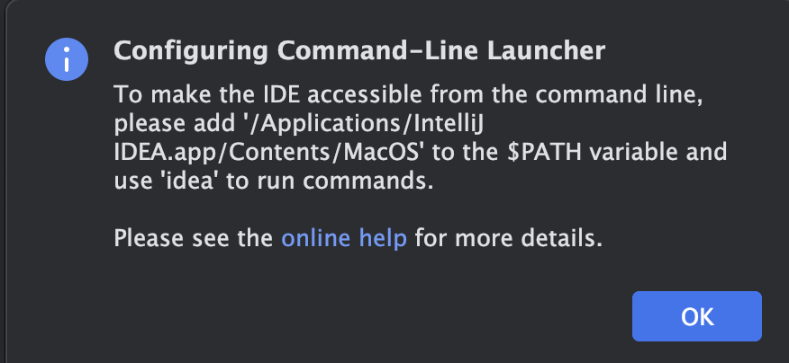

# Environment Setting

<details>

<summary>Homebrew</summary>

[Homebrew](https://brew.sh/)

```bash
/bin/bash -c "$(curl -fsSL https://raw.githubusercontent.com/Homebrew/install/HEAD/install.sh)"
```

[Homebrew Formulae](https://formulae.brew.sh/) < brew 통해서 설치하고 싶은 패키지 검색

</details>

<details>

<summary>iTerm2</summary>

Mac OS 10.15 버전인 카탈리나부터는 기본 쉘로 zsh를 사용\
프레임워크 없는 zsh는 빈 껍데기에 불과

oh my zsh 설치

```sh
sh -c "$(curl -fsSL https://raw.githubusercontent.com/ohmyzsh/ohmyzsh/master/tools/install.sh)" 
```


[iTerm2](https://iterm2.com/)

```bash
brew install --cask iterm2
```

#### Prompt 설정하기

✅ .zshrc에 **커스텀 명령어 라인** **설정** 코드와 **언어 설정** 코드를 입력합니다.

\*\* 언어 설정 코드는 Mac 시스템 언어가 한글일 경우에만 추가해주세요.

1. .zshrc 파일을 vim편집기로 열어주세요.

```bash
## .zshrc 파일을 편집하기
vi ~/.zshrc
```

2. zshrc 파일에 아래 코드를 입력해주세요.

```bash
## COMMAND LINE CUSTOM
PS1="~ "

## LANGUAGE
LANG="en_US.UTF-8"
```

</details>

<details>

<summary>SDK</summary>

[SDK MAN](https://sdkman.io/)

```bash
curl -s "https://get.sdkman.io" | bash
```

```bash
export SDKMAN_DIR="$HOME/.sdkman"
[[ -s "$HOME/.sdkman/bin/sdkman-init.sh" ]] && source "$HOME/.sdkman/bin/sdkman-init.sh"
```

```bash
source ~/.zshrc
```

```bash
sdk --help
```

```bash
# Temurin jdk 목록 확인 
sdk list java | grep tem

# jdk 설치
sdk install java 18.0.1-tem

# 설치된 jdk 목록 확인 
sdk list java | grep installed

# 현재 사용중인 jdk 확인
sdk current

# 현재 java 버전 확인
java —version
```

이미 설치된 자바버젼으로 인해 IDE에서 환경변수 수정 관련 에러가 발생한다면

```bash
export JAVA_HOME="$HOME/.sdkman/candidates/java/current"
```

```bash
sdk --help
```

</details>

<details>

<summary>IntelliJ IDEA</summary>

[Formulae 검색](https://formulae.brew.sh/cask/intellij-idea#default) \*CE버젼은 검색

#### 단축 명령어 설정하기

1. 상단 메뉴 중 `tools` → `create command line` 를 클릭하거나 `shift` 키를 두번 눌러 `create command line`-luncher 를 검색하여 클릭해줍니다. `ok` 를 눌러 intellij 열기 명령어를 생성해줍니다.\
   \
   환경변수 설정을 위한 경로 확인
2. \~/.zshrc 파일을 편집하여 맨 아래줄에 다음을 추가한다.\
   `export PATH=$PATH:/Applications/IntelliJ\ IDEA.app/Contents/MacOS`\
   `source ~/.zshrc`\
   \
   안될 경우 Intellij toolbox 설치하면 경로추가 자동
3. 생성한 명령어는 iterm에서 해당 폴더를 intelliJ를 이용해 프로젝트를 여는데 사용됩니다. 프로젝트를 열 때 터미널에서 idea <경로> 명령어를 이용해 열어주세요.

#### 설정 추가하기

아래의 설정을 추가로 변경해주세요.

1. [\*\*IntelliJ Java import wildcard 죽이기! \*\*](https://www.jetbrains.com/help/idea/creating-and-optimizing-imports.html#disable-wildcard-imports)
2. [**IntelliJ 힌트 죽이기!**](https://www.jetbrains.com/help/idea/2022.2/viewing-reference-information.html#inlay-hints)

```bash
brew install --cask intellij-idea
```

F2 = go to red alert

shift shift = finder

cmd + , => preference

cmd + shift + e = recent code

on save 검색 => 상위 두개 reformat check

gradle 검색 => build and run, test using IntelliJ : 속도가 더 빠름

cmd + alt + m => extract method

cmd + alt + c => extract Constant

</details>

<details>

<summary>Sourcetree</summary>

## Git GUI

```bash
brew install --cask sourcetree
```

의심 팝업시 Finder에서 보기 > 우클릭 열기 > 열기로 설치 완료

</details>

<details>

<summary>Node.js</summary>

## 자바스크립트 런타임

1.  아래 명령어를 복사한 뒤 iterm에서 붙여넣기해서 설치해주세요.

    ```bash
    brew install fnm
    ```
2. 아래 과정을 통해 현재 터미널에서 바로 사용하기 위해 명령어를 zshrc 파일에 추가해줍니다.
   1.  vim모드로 파일열기

       ```bash
       vi ~/.zshrc
       ```
   2. `i`를 눌러 편집모드 시작
   3.  명령어 붙여넣기

       ```bash
       eval "$(fnm env)"
       ```
   4. `esc`키를 눌러 편집모드 종료
   5. `:`키, `w`키, `q`키를 차례로 누르고 enter키를 눌러 저장하고 vim모드에서 나가기
   6. 저장한 파일 적용하기
3. 아래의 명령어를 순서대로 입력하여 설치된 fnm으로 설치가능한 노드의 버전을 확인하고 LTS(Long Term Support) 버전을 설치해주세요.

</details>

<details>

<summary>SSH</summary>

## Secure shell

1.  터미널에서 아래 명령어를 입력해 키가 존재하는 지 확인해주세요.

    ```bash
    ls -al ~/.ssh
    ```
2.  확인 후 키가 없다면 아래의 명령어를 입력해 키를 생성해줍니다. 쌍따옴표로 되어있는 부분에는 **GitHub**에 등록되어있는 **자신의 메일주소**를 입력해주세요.

    ```bash
    ssh-keygen -t ed25519 -C "GitHub 이메일 주소"
    ```
3.  화면에 "Enter a file in which to save the key,”라는 메세지가 나오면 Enter키를 입력해주세요. 그 후 화면에 아래와 같은 메세지가 나오면 차례대로 엔터를 두 번 입력해주세요.

    ```bash
    > Enter passphrase (empty for no passphrase): [Type a passphrase]
    > Enter same passphrase again: [Type passphrase again]
    ```
4.  아래 명령어를 입력해주세요.

    ```bash
    eval "$(ssh-agent -s)"
    ```
5. 아래 과정을 통해 ssh 키를 ssh-agent에 추가해주세요.
   1.  `config` 파일 존재 여부 확인 명령어 입력하기

       ```bash
       open ~/.ssh/config
       ```
   2.  `config` 파일 생성하기

       ```bash
       touch ~/.ssh/config
       ```
   3.  vim모드로 `config` 파일 열고 코드 입력하기

       ```bash
       vi ~/.ssh/config
       ```
   4. `i`를 눌러 편집모드 시작
   5.  명령어 붙여넣기

       ```bash
       Host *
         AddKeysToAgent yes
         UseKeychain yes
         IdentityFile ~/.ssh/id_ed25519
       ```
   6. `esc`키를 눌러 편집모드 종료
   7. `:`키, `w`키, `q`키를 차례로 누르고 enter키를 눌러 저장하고 vim모드에서 나가기
6.  아래 명령어를 입력해 ssh에 설정을 등록합니다.

    ```bash
    ssh-add -K ~/.ssh/id_ed25519
    ```
7.  아래 명령어를 입력해 ssh 키를 복사해줍니다.

    ```bash
    pbcopy < ~/.ssh/id_ed25519.pub
    ```
8. GitHub 페이지의 우측 상단 메뉴에서 “Settings”를 클릭한 후 “Access”부분의 “SSH and GPC keys”를 클릭합니다.
9. “New SSH key” 버튼을 클릭합니다.
10. “Title” 부분에는 Key 이름을 지정해서 입력해주고 “”Key” 부분에는 복사된 ssh 키를 붙여넣어줍니다.
11. “Add SSH Key” 버튼을 클릭해줍니다.
12. GitHub 비밀번호를 입력해 완료를 해줍니다.

</details>

<details>

<summary>Git</summary>

#### **설치하기**

1.  아래 명령어를 복사한 뒤 터미널에서 붙여넣기해서 설치해주세요.

    ```bash
    brew install git 
    ```
2.  아래의 명령어를 터미널에 입력해 git 버젼을 확인해주세요.

    ```bash
    git --version
    ```

***

📚 Git을 설치하고 나면 Git의 사용 환경을 적절하게 설정해주어야 합니다. 환경설정은 한 컴퓨터에서 최초 한번만 설정하면 되고 Git의 버전을 업그레이드 해도 유지됩니다. 기본 설정으로 사용자 정보를 설정해주어야 합니다.

#### **설정하기**

1.  아래의 명령어를 터미널에 입력해 사용자 이름을 설정해주세요.

    ```bash
    git config --global user.name "GitHub에서 사용하는 이름"
    ```
2.  아래의 명령어를 터미널에 입력해 사용자 이메일을 설정해주세요.

    ```bash
    *git* config --global user.email "GitHub 이메일 주소"
    ```
3.  아래의 명령어로 설정한 모든 것을 확인하실 수 있습니다.

    ```bash
    git config --list 
    ```

#### Git ssh

https://www.lainyzine.com/ko/article/creating-ssh-key-for-github/

</details>

<details>

<summary>Docker / postgresql</summary>

https://www.docker.com/products/docker-desktop/

Mac의 경우 최신 OS 버젼(Sonoma)로 업데이트를 해야 컨테이너가 실행되는 (Docker Desktop Stopped)에러가 있었다.

```shell
# docker 에 postgres 도커 이미지 다운받기
docker pull postgres

# postgres 이미지 실행(포트는 자동으로 5432 로 세팅됩니다.)
docker run -p 5432:5432 --name demo -e POSTGRES_PASSWORD=password -d postgres

# docker 실행 확인
docker ps
```

</details>

<details>

<summary>Postico</summary>

* postico 설치: `brew install --cask postico`
* 아래처럼 입력 후 `Connect` 를 눌러 주세요.

postgresql 기준

* Host: localhost / Port: 5432
* Host: localhost
* User: postgres
* password: password
* database: postgres

\=> connect

</details>

<details>

<summary>lombok</summary>

1\. marketplace install 2. annotation processors on

</details>
