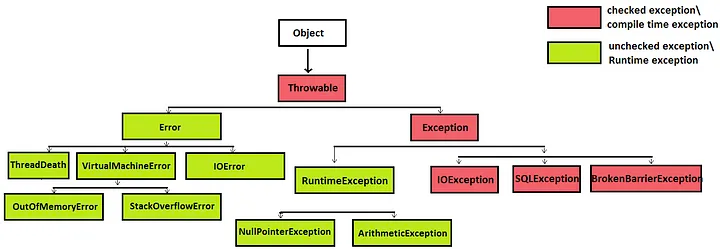

# Java Exceptions

Java에서 예외는 3가지로 볼 수 있다.

1. Checked Exception: Exception(컴파일 시 발생하는 예외, 예측 가능) 상속 => 예외처리 필수. ex)class IOException extends Exception: 어떠한 입출력 예외
2. Error
3. UnChecked Exception: RuntimeException(실행 시 발생하는 예외)을 상속 => 예외발생을 코드에서 방지

---

### 예외처리

1. try-catch(예외복구)
2. throws(예외처리 회피): 메소드를 호출한 곳으로 예외 처리를 떠넘김
3. throws with Wrapping(예외 전환): 호출한 쪽에 던지는데, 더 명확하게 인지할 수 있도록 돕는 방법.
4. Try-with-resources:  선언된 객체들에 대해서 try가 종료될 때 자동으로 자원을 해제해주는 기능(Java7부터)
   try에서 선언된 객체가 AutoCloseable을 구현하였다면 Java는 try구문이 종료될 때 객체의 close() 메소드를 호출해 줍니다.

---

### throw와 throws의 차이

- throw: 메서드 내에서 예외를 발생시키는 데 사용된다.(예: throw new FoolException())
- thorws: 메서드 선언부에서 사용되며, 해당 메서드가 처리하지 않은 예외를 호출자에게 전달함을 나타낸다.(예: public void sayNick(String nick) throws FoolException)

