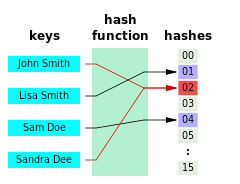
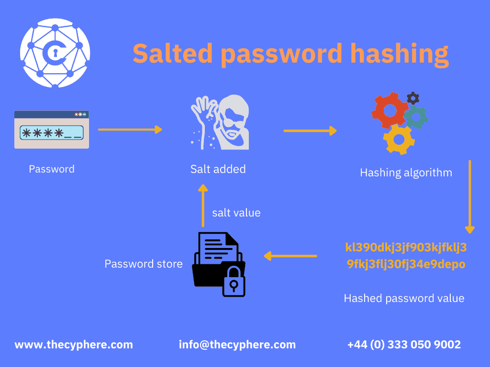
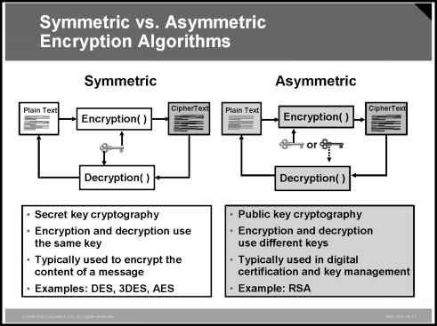

# Encryption & Decryption

> [암호화](https://ko.wikipedia.org/wiki/암호화)
>

> [해시 함수](https://ko.wikipedia.org/wiki/해시_함수)
>

> [암호화 해시 함수](https://ko.wikipedia.org/wiki/암호화_해시_함수)
>

> [Bcrypt](https://ko.wikipedia.org/wiki/Bcrypt)
>

> [Scrypt](https://en.wikipedia.org/wiki/Scrypt)
>

> [Argon2](https://ko.wikipedia.org/wiki/Argon2)
>

> [Balloon hashing](https://en.wikipedia.org/wiki/Balloon_hashing)
>

암호화는 평문(원래 값)을 남들이 알기 어렵도록 변환해서 암호문을 만드는 작업이다. 암호문을 다시 평문으로 변환하는 작업은 복호화라고 한다. 일반적으로는 암호문을 평문으로 되돌릴 수 있지만, 평문으로 되돌릴 수 없는
암호화도 있다.

- 일반적인 암호화/복호화: 평문 ↔ 암호문
- 단방향 암호화: 평문 → 암호문 (비가역적)

사용자의 패스워드를 평문으로 저장하거나 복호화 가능한 형태로 암호화해서 저장하지 않고 평문으로 되돌릴 수 없는 형태로 암호화해서 저장해서, 혹시라도 서버에 저장된 패스워드가 유출됐을 때 사용자의 패스워드(평문)이
직접적으로 드러나지 않게 한다.

원래의 패스워드로 복호화가 불가능하다면 어떻게 올바른 패스워드로 로그인을 시도했는지 알 수 있을까? 사용자가 (로그인을 하려고) 입력한 패스워드를 암호화해서 저장된 (즉, 이미 암호화된) 값과 비교함으로써 패스워드를
올바르게 입력했는지 확인한다.

예를 들면 다음과 같다:

1. 준비: 회원 가입할 때 입력한 패스워드로 “password”를 입력.
    - 서버에서 단방향 암호화하면 “6f9078fa76fabdc827a86c6d33e52310”를 얻게 된다.
    - 이 값을 DB에 저장하면 준비가 끝난다.
2. 시나리오 #1: 로그인할 때 패스워드로 “password”를 입력.
    - 서버에서 단방향 암호화하면 “6f9078fa76fabdc827a86c6d33e52310”를 얻게 된다.
    - 이 값을 DB에 있는 값과 비교하면, 같기 때문에 로그인이 성공하게 된다.
3. 시나리오 #2: 로그인할 때 패스워드로 “test”를 입력.
    - 서버에서 단방향 암호화해서 “9942462daae6b66431866c1b5769cfc4”를 얻게 된다.
    - 이 값을 DB에 있는 값과 비교하면, 다르기 때문에 로그인이 실패하게 된다.

[해시 함수](https://ko.wikipedia.org/wiki/%ED%95%B4%EC%8B%9C_%ED%95%A8%EC%88%98)


암호용 해시 함수는 매핑된 해싱 값만을 알아가지고는 원래 입력 값을 알아내기 힘들다는 사실에 의해 사용될 수 있다

단방향 암호화를 위해 암호학적 해시 알고리즘을 사용하고, 암호학적 해시 알고리즘은 다음의 성질을 갖는다.

1. 역상(pre-image) 저항성: 해시 값(암호문)에서 원래 값(평문)을 찾을 수 없어야 한다.
2. 제2 역상 저항성: 원래 값과 다르지만 동일한 해시 값으로 변환되는 다른 값을 찾을 수 없어야 한다.
3. 충돌 저항성: 동일한 해시 값으로 변환되는 두 개의 값을 찾을 수 없어야 한다.

아주 간단한 해시 함수 “f(x) = x % 10”가 암호학적 해시 알고리즘인지 검증해 보자. 이걸 사용하면, 평문(원래 값)이 13일 때 암호문(해시 값)은 3이 된다.

1. 역상 저항성: 암호문 3을 보고 원래 값을 바로 찾는 건 쉽지 않다. 하지만 몇 번 반복적으로 시도했을 때 원래 값이 13이라는 걸 찾을 가능성이 상당히 높다.
2. 제2 역상 저항성: 암호문 3을 보고 원래 값을 바로 찾을 수는 없지만, 동일한 암호문을 만드는 3, 23, 33 등의 값을 찾아낼 수 있다.
3. 충돌 저항성: 우리는 1, 11, 21, 31 등의 평문이 1이라는 동일한 암호문으로 변환된다는 걸 쉽게 알아낼 수 있다.

즉, 해시 함수 “f(x) = x % 10”는 안전하게 사용할 수 있는 해시 알고리즘이 아니다.

사용자의 패스워드를 단방향으로 암호화하기 위해 예전에는 bcrypt나 scrypt를 많이 썼는데, 최근에는 Argon2나 Balloon을 사용한다. Argon2는 2015년 Password Hashing
Competition에서 우승했고, Spring Security에서도 지원하고 있으니 특별한 경우가 아니라면 이걸 사용하자.


---

### Argon2

- [Argon2PasswordEncoder](https://docs.spring.io/spring-security/site/docs/current/api/org/springframework/security/crypto/argon2/Argon2PasswordEncoder.html)

Argon2은 비밀번호 해싱 함수로, 비밀번호를 안전하게 저장하고 검증하기 위한 목적으로 설계된 최신의 알고리즘 중 하나입니다. Argon2는 Password Hashing Competition(PHC)에서 우승한
결과물로 선택되었으며, 강력한 보안 기능과 고도로 구조화된 설계로 알려져 있습니다.

Argon2는 다양한 환경에서 사용될 수 있도록 몇 가지 변종을 제공합니다:

1. **Argon2d:**
    - 데이터 독립형(Data-dependent) 솔트와 메모리 피슽 메커니즘을 사용하여 디스크립터를 계산합니다.
    - 주로 메모리 바운드(memory-bound) 작업에 사용됩니다.

2. **Argon2i:**
    - 데이터 독립형 솔트와 인덱스 주소들을 사용하여 디스크립터를 계산합니다.
    - 주로 CPU 바운드(CPU-bound) 작업에 사용됩니다.

3. **Argon2id:**
    - Argon2i와 Argon2d를 혼합한 버전으로, 두 가지의 혼합적인 방식을 사용합니다.
    - 초기 연산에는 Argon2i의 방식을 사용하고, 나중에는 Argon2d의 방식을 사용합니다.

Argon2의 주요 특징과 장점은 다음과 같습니다:

- **고도로 구조화된 디자인:** Argon2는 높은 수준의 보안을 제공하는 동시에 사용이 간편하도록 설계되었습니다.

- **데이터 독립형 솔트 사용:** 각 비밀번호 해싱에 대해 고유한 솔트가 사용되므로 레인보우 테이블 공격을 방지합니다.

- **메모리 및 CPU 바운드 작업:** Argon2는 메모리 바운드와 CPU 바운드를 적절하게 혼합하여 다양한 환경에서의 공격을 어렵게 만듭니다.

- **탄력적인 구성 옵션:** Argon2는 파라미터를 조절하여 메모리 및 계산 비용을 설정할 수 있습니다. 이를 통해 공격자가 비밀번호를 더 어렵게 찾을 수 있도록 조정할 수 있습니다.

Java에서 Argon2를 사용하려면 외부 라이브러리를 사용해야 합니다. `argon2-java`와 같은 라이브러리를 이용하면 Java 애플리케이션에서 Argon2를 편리하게 사용할 수 있습니다. 라이브러리의
사용법은 해당 라이브러리의 문서를 참고하시면 됩니다.

---

### Salt



솔트는 해시 함수를 사용할 때 원본 문자열에 추가되는 임의의 데이터 문자열입니다. 일반적으로 비밀번호 보호를 강화하고 무차별 대입 공격으로부터 보호하는 데 사용됩니다. 두 명 이상의 사용자가 동일한 비밀번호를 사용할
수 있으므로 유사한 해시가 저장됩니다. 무작위 문자열을 사용하면 매번 고유한 해시가 생성되므로 솔트는 이러한 일이 발생하지 않도록 방지합니다.

공격자가 침해된 데이터베이스에 액세스하여 저장된 중복 해시를 본 경우 솔팅이 없거나 약한 알고리즘이 사용되어 충돌이 발생하고 있기 때문일 수 있습니다.

---

### JWT

JWT( JSON Web Token)는 웹 상에서 정보를 안전하게 전송하기 위해 정의된 간단한 데이터 구조입니다. 특히, 클라이언트와 서버 간의 정보를 JSON 객체로 안전하게 전달하기 위해 사용됩니다. JWT는
기본적으로 서명된 토큰으로, 페이로드(Payload)에 클레임(Claim)이라는 정보를 담고 있습니다.

<details>
<summary>Claims-based identity
</summary>
JWT( JSON Web Token)와 Claim Based Identity는 인증 및 권한 관리를 위한 토큰 기반의 접근 제어 시스템에서 사용되는 중요한 개념입니다.

### JWT (JSON Web Token):

JWT는 JSON 형식의 데이터를 사용하여 정보를 안전하게 전달하는 토큰입니다. 주로 웹 애플리케이션 간에 사용자의 인증 및 권한 정보를 전송하는 데에 사용됩니다. JWT는 다음과 같은 특징을 가지고 있습니다:

1. **Self-Contained (자체 포함):** JWT는 헤더, 페이로드, 서명 세 부분으로 구성되어 있으며, 이들을 Base64 인코딩하여 하나의 문자열로 만듭니다. 토큰 자체가 필요한 모든 정보를 포함하고
   있어서 별도의 서버 저장소가 필요 없습니다.

2. **Digital Signature (디지털 서명):** 토큰의 유효성을 확인하기 위해 서명이 사용됩니다. 이를 통해 토큰이 변경되지 않았음을 보장하고, 발행자의 신원을 검증할 수 있습니다.

3. **Compact and URL-Safe (간결하고 URL 안전):** Base64로 인코딩된 문자열이므로 URL 안전하며, 전송과 저장이 간편합니다.

### Claim Based Identity:

Claim은 특정 주체(Subject)에 대한 속성이나 권한 등을 나타내는 정보입니다. Claim Based Identity는 사용자의 신원 정보를 사용자의 속성(Claims)으로 표현하고, 이를 기반으로 인증 및
권한을 관리하는 방식입니다. 각 Claim은 특정한 정보를 나타내며, 주로 사용자의 신원, 역할, 권한 등을 나타냅니다.

JWT에서는 페이로드 부분이 Claims를 포함하고 있습니다. 이 Claims는 JSON 형식으로 표현되며, 사용자의 신원 정보를 나타냅니다. 예를 들면 다음과 같습니다:

```json
{
  "sub": "1234567890",
  "name": "John Doe",
  "admin": true
}
```

- **sub (Subject):** 사용자의 고유 식별자
- **name:** 사용자의 이름
- **admin:** 사용자가 관리자 권한을 가지고 있는지 여부

Claim Based Identity를 사용하면 사용자의 정보를 토큰에 포함시켜 간편하게 전달하고, 필요한 권한을 획득할 수 있습니다. 또한, 서버 측에서는 토큰을 검증하고 필요한 클레임을 확인하여 사용자의 권한을
쉽게 관리할 수 있습니다.

</details>


JWT는 다음과 같은 세 가지 파트로 이루어져 있습니다:

1. **Header(헤더):**
    - JWT의 타입과 사용하는 해싱 알고리즘 정보를 담고 있습니다.
    - 일반적으로는 다음과 같은 형식을 가지며, Base64로 인코딩되어 있습니다.

    ```json
    {
      "alg": "HS256",
      "typ": "JWT"
    }
    ```

2. **Payload(페이로드):**
    - 클레임(사용자, 권한, 기타 정보)이 포함된 부분입니다.
    - 토큰의 정보를 담고 있는 부분으로, 사용자 정의 데이터나 토큰의 유효 기간 등이 여기에 포함됩니다.
    - 일반적으로는 다음과 같은 형식을 가지며, Base64로 인코딩되어 있습니다.

    ```json
    {
      "sub": "1234567890",
      "name": "John Doe",
      "iat": 1516239022
    }
    ```

3. **Signature(서명):**
    - 헤더와 페이로드를 합친 후, 비밀 키로 서명한 부분입니다.
    - 서명은 토큰이 변조되지 않았음을 확인하는 역할을 합니다.

JWT의 구조는 다음과 같이 되어 있습니다:

```
Header.Payload.Signature
```

클라이언트가 서버에 로그인하거나 리소스에 접근할 때 JWT를 사용하면, 서버는 JWT를 발행하고 클라이언트는 이를 저장하여 계속해서 요청에 포함시킵니다. 서버는 이 JWT를 검증하여 사용자의 신원을 확인하고,
클라이언트에게 해당 리소스에 접근할 권한을 부여합니다.

Spring Security와 같은 프레임워크에서는 JWT를 사용하여 인증 및 권한 부여를 구현할 수 있습니다. Spring Security에서는 `JwtAuthenticationToken`과 같은 클래스를 사용하여
JWT 기반의 인증을 지원합니다. 설정과 사용법은 프레임워크 버전에 따라 다를 수 있으므로 해당 버전의 문서를 참고하는 것이 좋습니다.

---

### 공개키 암호화 / 대칭키 암호화



대칭키 암호화(Symmetric Key Encryption)와 공개키 암호화(Asymmetric Key Encryption)는 암호화 기술에서 사용되는 두 가지 주요 접근 방식입니다.

### 대칭키 암호화 (Symmetric Key Encryption):

1. **동일한 키 사용:**
    - 대칭키 암호화에서는 하나의 키를 암호화와 복호화에 모두 사용합니다. 암호화된 데이터를 해독하려면 동일한 키가 필요합니다.

2. **속도가 빠름:**
    - 대칭키 암호화는 키가 작고, 알고리즘이 간단하며, 처리 속도가 빠르다는 장점이 있습니다.

3. **안전한 키 교환이 필요:**
    - 주요 문제는 키를 안전하게 교환하는 것입니다. 만약 제3자가 키를 가로챈다면 통신이 위험에 노출됩니다.

4. **예시 알고리즘:**
    - AES (Advanced Encryption Standard), DES (Data Encryption Standard), 3DES 등이 대표적인 대칭키 알고리즘입니다.

### 공개키 암호화 (Asymmetric Key Encryption):

1. **공개 키와 개인 키:**
    - 공개키 암호화에서는 공개 키와 개인 키 두 가지 키를 사용합니다. 데이터를 암호화하면 공개 키로 암호화하고, 개인 키로 복호화합니다.

2. **안전한 키 교환:**
    - 대칭키 암호화에서의 키 교환 문제를 해결하기 위해 사용됩니다. 공개 키는 공개될 수 있고, 개인 키는 비밀로 유지됩니다.

3. **약간 느림:**
    - 대칭키 암호화보다 약간 느리지만, 키 교환에 대한 보안적 이점이 있습니다.

4. **예시 알고리즘:**
    - RSA (Rivest-Shamir-Adleman), ECC (Elliptic Curve Cryptography), DSA (Digital Signature Algorithm) 등이 대표적인 공개키
      알고리즘입니다.

### 종합:

- **대칭키와 공개키의 혼합 사용:**
    - 일반적으로는 대칭키 암호화의 속도와 공개키 암호화의 안전성을 혼합하여 사용하는 경우가 많습니다. 데이터의 대칭키 암호화에 대한 효율성과 안전한 키 교환을 위한 공개키 암호화를 조합하는 것이 일반적입니다.

- **TLS/SSL 프로토콜:**
    - 웹에서는 대표적으로 TLS/SSL 프로토콜이 대칭키와 공개키를 조합하여 사용합니다. 초기 통신에서는 공개키를 사용하여 대칭키를 안전하게 교환하고, 이후의 데이터 전송은 대칭키 암호화로 이루어집니다.

각 암호화 방식은 특정 상황에 적합하며, 보안 요구사항과 성능 등을 고려하여 선택되어야 합니다.