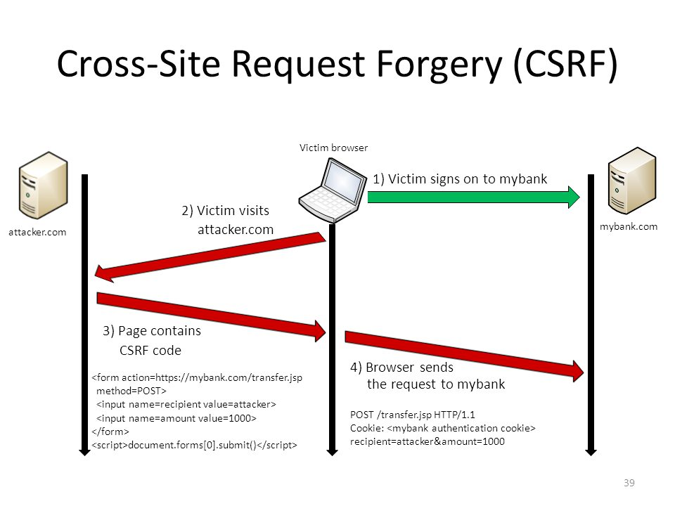

# Vulnerability(취약점)

### CSRF


CSRF(Cross-Site Request Forgery)는 웹 애플리케이션에서 발생하는 보안 취약점 중 하나로, 인증된 사용자의 권한을 이용하여 공격자가 의도한 행위를 수행하게 하는 공격입니다. CSRF는 악의적인
웹사이트나 이메일과 같은 곳에서 사용자의 브라우저를 통해 다른 웹사이트에 대한 요청을 위조하는 방식으로 이루어집니다.

CSRF 공격을 방지하기 위해 사용되는 주요 방법은 다음과 같습니다:

1. **CSRF 토큰 사용:**
    - 애플리케이션에서는 폼이나 AJAX 요청 등의 각각의 요청에 대해 고유한 CSRF 토큰을 생성하고 이를 클라이언트에게 전달합니다.
    - 이 토큰은 사용자 세션에 바인딩되어 있어 공격자가 위조하기 어렵게 합니다.
    - 서버는 요청을 받을 때 이 토큰을 확인하고 일치하지 않으면 요청을 거부합니다.

2. **SameSite 쿠키 속성:**
    - SameSite 쿠키 속성은 쿠키가 어떤 상황에서 전송되는지 제어하는 데 사용됩니다.
    - SameSite=None 속성을 설정하고 Secure 속성이 함께 설정되어야 안전한 (HTTPS) 연결에서도 쿠키가 전송됩니다.

    ```java
    Set-Cookie: myCookie=myValue; SameSite=None; Secure
    ```

3. **Referrer 검증:**
    - 서버에서는 HTTP Referrer 헤더를 검증하여 요청이 기대한 출처에서 왔는지 확인할 수 있습니다.
    - 하지만 Referrer 헤더는 항상 신뢰할 수 있는 정보가 아니므로 단독으로 사용하는 것은 권장되지 않습니다.

4. **HTTP 메서드 제한:**
    - 중요한 작업을 수행하는 요청에 대해 GET 요청만 허용하고 POST, PUT, DELETE 등의 요청은 특별한 권한이 있는 경우에만 허용하는 방법을 사용할 수 있습니다.

5. **타임아웃 설정:**
    - CSRF 토큰이나 세션의 유효 시간을 설정하여 공격자가 장기간에 걸쳐 토큰을 사용하지 못하게 합니다.

Spring Security에서는 CSRF 공격을 방어하기 위해 기본적으로 CSRF 토큰을 사용하며, 이를 비활성화하거나 사용자 정의 설정으로 조정할 수 있습니다. 아래는 Spring Security에서 CSRF
보호를 비활성화하는 예시입니다:

```java

@Configuration
@EnableWebSecurity
public class SecurityConfig extends WebSecurityConfigurerAdapter {

    @Override
    protected void configure(HttpSecurity http) throws Exception {
        http
                .csrf().disable() // CSRF 보호 비활성화
                .authorizeRequests()
                .antMatchers("/public/**").permitAll()
                .anyRequest().authenticated()
                .and()
                .formLogin()
                .and()
                .httpBasic();
    }
}
```

보안 상의 이유로 CSRF 보호를 비활성화하는 것은 권장되지 않으며, 가능한 한 CSRF 토큰을 사용하여 보안을 강화하는 것이 좋습니다.


---