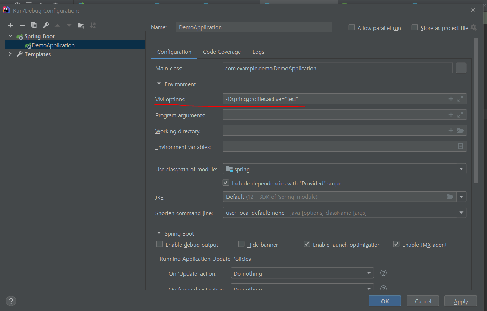

# Environment Variable(환경변수)

### 환경변수

프로세스가 컴퓨터에서 동작하는 방식에 영향을 미치는, 동적인 값들의 모임

런타임 시 다양한 환경에서 동작할 수 있도록 필요한 옵션들을 제공


---

### 환경변수 설정

1. application.properties(yml) 조작
2. vm option(IDE gui edit configuration)에 -Dkey=value로 key,value값을 넘겨주면 됨.

---

### 환경변수 호출

1. @value("${}")
2. @PropertySource

```java

@SpringBootApplication
@PropertySource("classpath:/app.properties")
public class DemoApplication {

    public static void main(String[] args) {
        SpringApplication.run(DemoApplication.class, args);

    }

}
```

3. context.getEnvironment().getProperty("")
4. @Autowired Environment.getProperty("")

### Property 우선 순위

Property 우선 순위
우선 순위를 간략히 정리하면 다음과 같다.

1. @TestPropertySource
2. @SpringBootTest(properties=...)
3. 커맨드 라인 argument
4. @PropertySource
5. 기본 프로퍼티

### Properties 파일 우선순위

application.properties 는 resources/ 말고 다른 곳에서도 사용될 수 있다.
이 때 application.properties 의 위치에 따른 우선 순위는 다음과 같다.

1. /config/
2. /
3. <classpath>/config/
4. <classpath>/

application.properties 는 키 이름에 _ (under score) 나 - (kebab) 가 포함되어도 알아서 **camleCase** 로 변환하여 바인딩 한다.

```properties
abc.full-name
abc.full_name
```

위 2개 모두 abc.fullName 에 바인딩 됨.

---

### Profile

> 개발환경의 profile로 개발환경, 테스트환경, 서비스환경마다 다르게 프로필을 정의해서 설정하고 싶을때 사용하는 기능임. (ex. dev,prod,stg)
>

1) spring.profiles.active 속성에 값을 부여

커맨드라인옵션 : --spring.profiles.active=dev

JVM vm옵션 :  -Dspring.profiles.active=dev

@Configuration 파일에서 @Profile("test") 선언

2) 설정파일명은 application-{profile}.properties로 한다.

application.properties(default)

application-dev.properties

application-prd.properties

```java

@Component
public class AppRunner implements ApplicationRunner {

    @Autowired
    ApplicationContext context;

    @Override
    public void run(ApplicationArguments args) throws Exception {
        Environment env = context.getEnvironment();
        System.out.println(Arrays.toString(env.getActiveProfiles()));
        System.out.println(Arrays.toString(env.getDefaultProfiles()));

        env.getProperty("app.name");
    }
}
```

ApplicationContext 안에는 Environment타입의 필드가 있는데, context.getEnvironment()로 꺼내와서 살펴볼 수 있다.

env.getActiveProfiles()는 현재 설정되어있는 profile을 Array로 가져옴(복수로 설정이 가능하기 때문에)
env.getDefaultProfiles()는 기본값의 profile을 가져옴

```java

@Configuration
@Profile("test") //프로파일 환경의 이름
public class TestConfiguration {
    //test프로파일 일때만 빈설정파일이 적용되어서 다른프로파일에서는 TestBookRepository를 주입받을 수 없음
    @Bean
    public BookRipository bookRipository() {
        return new TestBookRepository();
    }
}
```

application.properties 한 파일에서 여러 Profile을 선언할 수 있다.
그러나 더 아래줄에 spring.config.activate.on-profile 설정이 없는 profile정의가 있다면 무조건 해당 name으로 덮어씌어짐.

```properties
spring.config.activate.on-profile=dev
url=dev.test.com
name=dev
#---
spring.config.activate.on-profile=prd
url=prd.test.com
name=prd
#---
name=ver #name이 ver인 설정이 들어갔다.
```



---

#### 꼭 읽어볼 자료

[Spring Boot 알쏭달쏭한 환경변수 설정원리](https://code-run.tistory.com/6)