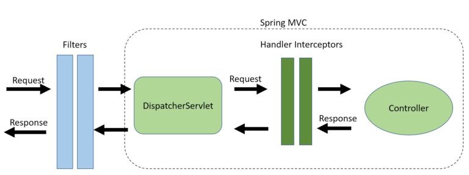
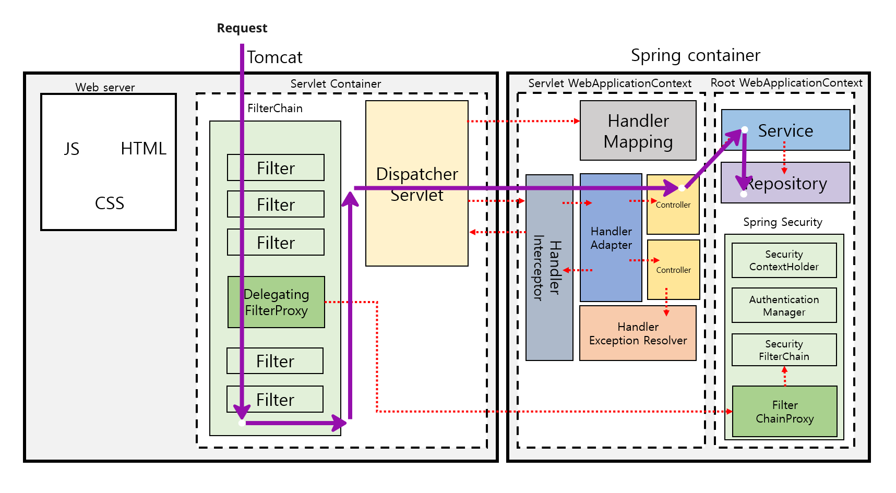
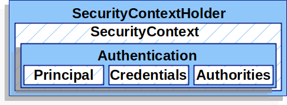

# Spring Security

---




### HandlerInterceptor

HandlerInterceptors는 Spring MVC 프레임워크의 일부이며 DispatcherServlet과 컨트롤러 사이에 위치합니다.

요청이 컨트롤러에 도달하기 전,뷰가 렌더링 전,후에 요청을 가로챌 수 있습니다.

핸들러 인터셉터는 DispatcherServlet과 컨트롤러 간의 요청을 가로챕니다. 이 작업은 Spring MVC 프레임워크 내에서 수행되며, 핸들러 및 ModelAndView 객체에 대한 액세스를 제공합니다.
이렇게 하면 중복을 줄이고 다음과 같은 보다 세분화된 기능을 사용할 수 있습니다:

- 애플리케이션 로깅과 같은 cross-cutting 문제 처리
- 세부적인 권한 검사
- Spring 컨텍스트 또는 모델 조작

### FilterChain

필터는 Spring 프레임워크가 아닌 웹 서버의 일부입니다. 들어오는 요청의 경우 필터를 사용하여 Spring 프레임워크의 요청을 조작하고 차단할 수도 있습니다.

필터를 사용하여 request를 조작하고 서블릿으로의 도달을 차단할 수도 있습니다. 그 반대로 응답이 클라이언트에 전달되지 않도록 차단할 수도 있습니다.

Spring Security는 인증 및 권한 부여에 필터를 사용하는 좋은 예입니다. Spring Security를 구성하려면 DelegatingFilterProxy라는 단일 필터만 추가하면 됩니다.

그런 다음 Spring Security는 들어오고 나가는 모든 트래픽을 가로챌 수 있습니다. 이것이 Spring Security가 Spring MVC 외부에서 사용될 수 있는 이유입니다.

필터는 요청이 DispatcherServlet에 도달하기 전에 요청을 가로채기 때문에 다음과 같은 세분화된 작업에 이상적입니다:

- Authentication
- Logging and auditing
- Image and data compression
- Any functionality we want to be decoupled from Spring MVC

### 결론

핵심은 필터를 사용하면 요청이 컨트롤러에 도달하기 전, 그리고 Spring MVC 외부에서 요청을 조작할 수 있다는 것입니다.

반면에, 핸들러인터셉터는 애플리케이션별 크로스 커팅 문제를 해결하기에 좋은 곳입니다.
대상 핸들러 및 ModelAndView 객체에 대한 액세스를 제공함으로써 보다 세분화된 제어가 가능합니다.

---

### Filter vs OncePerRequestFilter

`Filter`와 `OncePerRequestFilter`는 모두 Spring Framework에서 HTTP 요청을 처리하는 데 사용되는 클래스입니다.

`OncePerRequestFilter`는 보통 모든 요청에 대해 일관된 동작을 수행해야 할 때 사용됩니다. 예를 들어, 요청에 대한 전처리나 후처리 작업을 수행하거나, 특정 조건에 따라 필터 동작을 결정해야 할 때
유용합니다. `Filter`와 `OncePerRequestFilter`는 모두 일반적인 필터 구현을 제공하며, 상황에 따라 선택하여 사용할 수 있습니다.

1. **Filter:**
    - Java Servlet API에서 제공하는 기본 `Filter` 인터페이스를 구현한 클래스입니다.
    - Spring에서 `Filter`를 사용하려면 `FilterRegistrationBean`을 통해 등록해야 합니다.

    ```java
    public class MyFilter implements Filter {
        // 구현 내용
    }
    
    @Configuration
    public class MyFilterConfig {

        @Bean
        public FilterRegistrationBean<MyFilter> myFilter() {
            FilterRegistrationBean<MyFilter> registrationBean = new FilterRegistrationBean<>();
            registrationBean.setFilter(new MyFilter());
            registrationBean.addUrlPatterns("/api/*");
            return registrationBean;
        }
    }
    ```

2. **OncePerRequestFilter:**
    - `OncePerRequestFilter`는 Spring에서 제공하는 특별한 `Filter` 클래스로, 모든 요청에 대해 한 번만 실행되도록 보장합니다.
    - `OncePerRequestFilter`를 직접 상속하여 구현하거나, 기존의 `GenericFilterBean` 클래스를 확장하는 방법도 있습니다.

    ```java
    public class MyOncePerRequestFilter extends OncePerRequestFilter {
        @Override
        protected void doFilterInternal(HttpServletRequest request, HttpServletResponse response, FilterChain filterChain) throws ServletException, IOException {
            // 구현 내용
        }
    }
    ```

    ```java
    @Configuration
    public class MyFilterConfig {

        @Bean
        public FilterRegistrationBean<MyOncePerRequestFilter> myOncePerRequestFilter() {
            FilterRegistrationBean<MyOncePerRequestFilter> registrationBean = new FilterRegistrationBean<>();
            registrationBean.setFilter(new MyOncePerRequestFilter());
            registrationBean.addUrlPatterns("/api/*");
            return registrationBean;
        }
    }
    ```

    - `OncePerRequestFilter`는 `doFilterInternal` 메서드를 오버라이드하여 구현하며, 해당 메서드는 각 요청에 대해 한 번 호출됩니다.

---

### SecurityContext



`SecurityContext`는 Spring Security에서 현재 인증된 사용자의 보안 정보를 저장하고 관리하는 인터페이스입니다. `SecurityContextHolder`를 통해 애플리케이션
전체에서 `SecurityContext`에 접근할 수 있습니다.

`SecurityContext`는 주로 다음과 같은 정보를 포함합니다:

1. **Authentication 객체:**
    - 현재 사용자의 인증 정보를 나타내는 객체입니다. 주로 `UsernamePasswordAuthenticationToken`, `JwtAuthenticationToken`, 또는 사용자
      정의 `Authentication` 객체가 포함됩니다.

2. **Principal 객체:**
    - `Authentication` 객체에서 파생된 사용자의 주체(Principal) 정보를 나타내는 객체입니다. 주로 `UserDetails` 인터페이스를 구현한 객체가 사용됩니다.

Spring Security에서 `SecurityContext`에 접근하고 다루는 주요 클래스 및 메서드는 다음과 같습니다:

1. **SecurityContextHolder:**
    - `SecurityContextHolder`는 현재 실행 중인 스레드의 `SecurityContext`에 액세스하기 위한 유틸리티 클래스입니다.
    - `SecurityContextHolder.getContext()`를 호출하여 현재 `SecurityContext`에 액세스할 수 있습니다.

2. **SecurityContextPersistenceFilter:**
    - 이는 Spring Security 필터 체인에서의 역할 중 하나로, `SecurityContext`의 유지 및 복원을 처리합니다.
    - 요청을 처리하는 동안 `SecurityContext`를 유지하고 응답을 전송할 때 원래 상태로 복원합니다.

3. **SecurityContextHolderStrategy:**
    - `SecurityContextHolder`가 어떻게 `SecurityContext`를 저장하고 복원하는지에 대한 전략을 정의하는 인터페이스입니다.
    - 기본적으로는 `ThreadLocal` 기반의 전략을 사용합니다.

예시 코드:

```java
// SecurityContext에 Authentication 객체 설정
Authentication authentication=...; // 적절한 Authentication 객체 생성
        SecurityContext securityContext=SecurityContextHolder.createEmptyContext();
        securityContext.setAuthentication(authentication);

// SecurityContext를 SecurityContextHolder에 설정
        SecurityContextHolder.setContext(securityContext);

// 현재 SecurityContext에 접근
        SecurityContext currentContext=SecurityContextHolder.getContext();
        Authentication currentAuthentication=currentContext.getAuthentication();

// 현재 사용자의 Principal 정보 가져오기
        Object principal=currentAuthentication.getPrincipal();

// 사용자가 "anonymousUser"인지 확인
        if(principal instanceof String&&principal.equals("anonymousUser")){
        // 익명 사용자 처리
        }
```

`SecurityContext`를 사용하면 Spring Security를 통해 인증 및 권한 부여된 사용자의 정보에 쉽게 액세스할 수 있습니다. 이를 통해 사용자의 상태를 확인하고 적절한 보안 로직을 적용할 수
있습니다.

---

### Spring Security PasswordEncoder

`PasswordEncoder`는 Spring Security에서 비밀번호를 안전하게 저장하고 검증하기 위한 인터페이스입니다. 비밀번호를 평문으로 저장하지 않고, 해시 함수를 사용하여 안전하게 저장하는 데
사용됩니다. `PasswordEncoder`는 사용자의 비밀번호를 암호화(해싱)하고, 저장된 암호화된 비밀번호와 사용자가 제공한 비밀번호를 비교하여 인증을 수행합니다.

Spring Security에서 사용할 수 있는 주요 `PasswordEncoder` 구현체는 다음과 같습니다:

1. **`BCryptPasswordEncoder`:**
    - BCrypt 해싱 알고리즘을 사용하는 `PasswordEncoder`입니다.
    - BCrypt는 안전하고 강력한 해싱 알고리즘으로, 랜덤 솔트(Salt)를 사용하여 비밀번호를 해싱합니다.

    ```java
    @Bean
    public PasswordEncoder passwordEncoder() {
        return new BCryptPasswordEncoder();
    }
    ```

2. **`PasswordEncoderFactories.createDelegatingPasswordEncoder()`:**
    - 다양한 해싱 알고리즘을 지원하는 `DelegatingPasswordEncoder`를 생성합니다.
    - 기본적으로는 BCrypt를 사용하지만, 다양한 알고리즘을 지원하고자 할 때 유용합니다.

    ```java
    @Bean
    public PasswordEncoder passwordEncoder() {
        return PasswordEncoderFactories.createDelegatingPasswordEncoder();
    }
    ```

    - `createDelegatingPasswordEncoder` 메서드를 통해 추가적인 설정이 가능합니다.

3. **`NoOpPasswordEncoder`:**
    - 비밀번호를 평문으로 저장하는 `PasswordEncoder`입니다. 보안상 취약하므로 사용을 지양해야 합니다.
    - 특정 상황에서 테스트 용도로 사용될 수 있습니다.

    ```java
    @Bean
    @Deprecated
    public PasswordEncoder passwordEncoder() {
        return NoOpPasswordEncoder.getInstance();
    }
    ```

4. **`MessageDigestPasswordEncoder`:**
    - `java.security.MessageDigest`를 사용하여 비밀번호를 해싱하는 `PasswordEncoder`입니다.
    - 특정한 알고리즘(예: SHA-256)을 선택하여 사용할 수 있습니다.

    ```java
    @Bean
    public PasswordEncoder passwordEncoder() {
        return new MessageDigestPasswordEncoder("SHA-256");
    }
    ```

선택한 `PasswordEncoder` 구현체는 주로 애플리케이션의 보안 정책, 요구 사항 및 성능을 고려하여 결정됩니다. 일반적으로는 `BCryptPasswordEncoder`를 권장하며, 가능한 한 강력한 해싱
알고리즘을 선택하여 사용해야 합니다.

___

### @Secured

`@Secured`는 Spring Security에서 메소드 수준의 보안을 설정하기 위해 사용되는 어노테이션 중 하나입니다. 이 어노테이션을 사용하면 특정 메소드에 대한 접근 권한을 설정할 수 있습니다.

### 사용 방법:

1. **의존성 추가:**
    - `@Secured` 어노테이션을 사용하려면 Spring Security의 의존성을 프로젝트에 추가해야 합니다.

2. **메소드에 `@Secured` 어노테이션 적용:**
    - 보호해야 하는 메소드에 `@Secured` 어노테이션을 적용합니다.

    ```java
    import org.springframework.security.access.annotation.Secured;

    public class MyService {

        @Secured("ROLE_USER")
        public void securedMethod() {
            // 메소드 내용
        }
    }
    ```

    - 위의 예제에서는 `ROLE_USER` 권한을 가진 사용자만이 `securedMethod` 메소드에 접근할 수 있습니다.

### 설정:

`@Secured` 어노테이션은 설정 파일에서도 사용할 수 있습니다. XML 기반 또는 Java 기반의 설정에서 다음과 같이 사용할 수 있습니다.

1. **XML 설정:**

    ```xml
    <security:global-method-security secured-annotations="enabled" />
    ```

2. **Java 설정 (Java Config):**

    ```java
    import org.springframework.context.annotation.Configuration;
    import org.springframework.security.config.annotation.method.configuration.EnableGlobalMethodSecurity;

    @Configuration
    @EnableGlobalMethodSecurity(securedEnabled = true)
    public class SecurityConfig {
        // ...
    }
    ```

### 다중 권한 설정:

`@Secured` 어노테이션은 여러 권한을 설정할 수 있습니다. 권한은 문자열 배열로 전달되며, 사용자는 배열에 포함된 어떤 권한이든 가지고 있어야 합니다.

```java
@Secured({"ROLE_USER", "ROLE_ADMIN"})
public void securedMethod(){
        // 메소드 내용
        }
```

이 경우에는 `ROLE_USER`와 `ROLE_ADMIN` 권한을 가진 사용자만이 해당 메소드에 접근할 수 있습니다.

`@Secured` 어노테이션은 간단하게 메소드에 대한 보안 설정을 할 수 있어서 편리하지만, 더 복잡한 권한 설정이나 동적 권한 처리가 필요한 경우에는 `@PreAuthorize` 어노테이션을 사용할 수도
있습니다.

---

출처:

https://www.baeldung.com/spring-mvc-handlerinterceptor-vs-filter

https://docs.spring.io/spring-security/reference/servlet/authentication/architecture.html